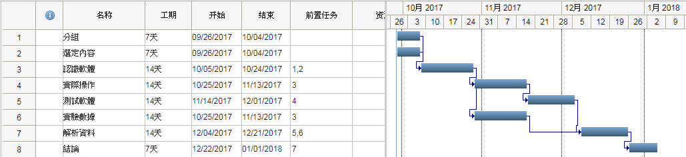
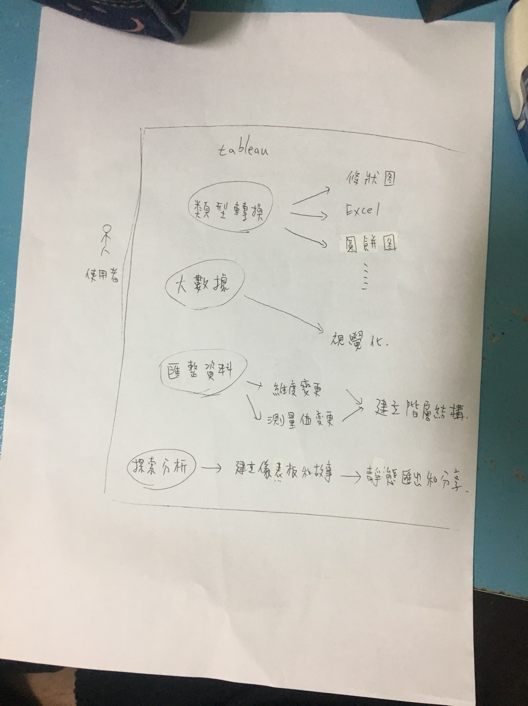
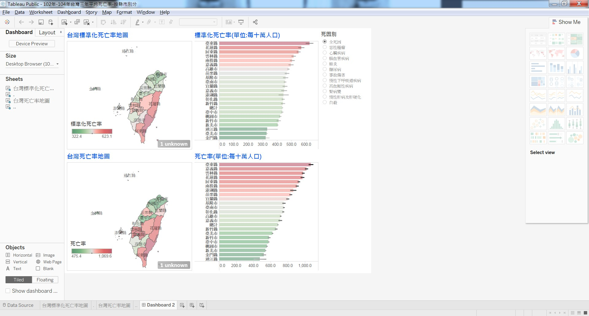
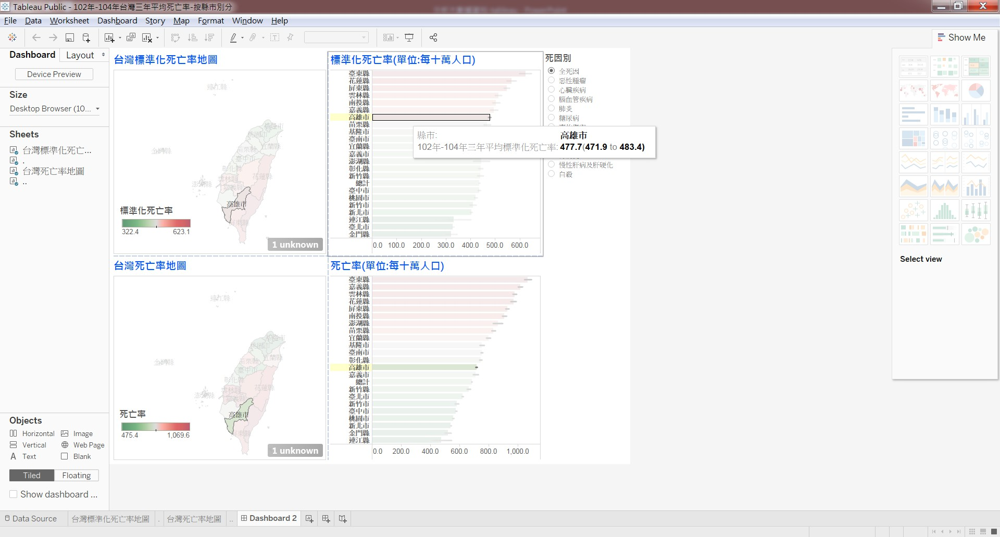
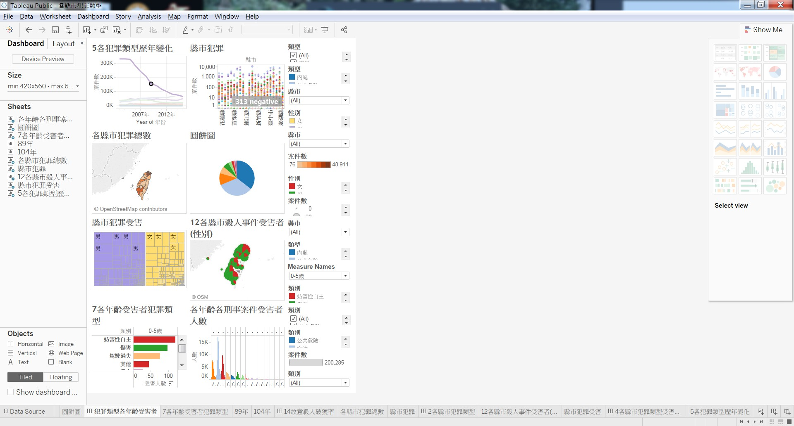

組別：第21組

#專題題目：使用tableau分析大數據資料-以犯罪、死亡為例

#指導老師：陳世智

組員：沈弘逸0224025、陳子豪0224022

工作分配：沈弘逸(負責犯罪)、陳子豪(負責死亡)

內容：分析大數據資料

效益：快速分析市場走向、數據資料，可預測下一步動作

HOW：使用tableau軟體，輸入大數據資料使軟體自動製作圖表，進而分析，
透過圖表更快速的了解大數據

上面是我個人負責的部分
